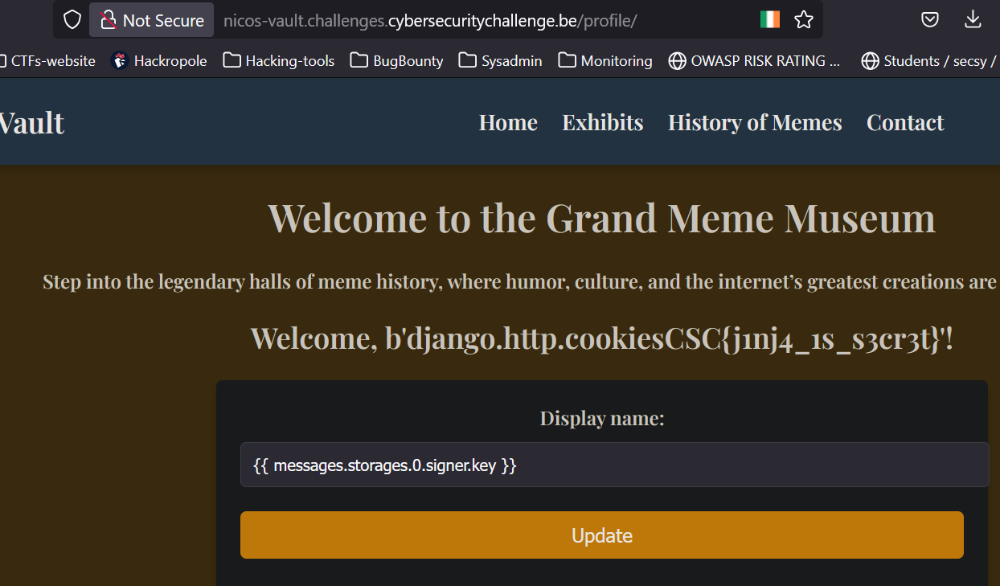

# Writeup 

- I created an account and logged in to the web page.  
- There was an option to update my display name, which was reflected on the same page.  
- Since user input was reflected, I considered two possible exploits: SSTI and XSS.  
- I ruled out XSS because there was no one else to view the payload, making it ineffective.  
- That left SSTI as the only viable path. I tested it using the payload `{{ 7 * 7 }}` — this caused an internal server error, which suggested SSTI was indeed possible.  
- I then tried payloads from different server-side template engines. One that worked was `{{ messages.storages.0.signer.key }}`, which I found in a [GitHub repo](https://github.com/Lifars/davdts).  
- The payload revealed the flag directly in the display name, confirming that the framework in use was Django.

# Flag 

